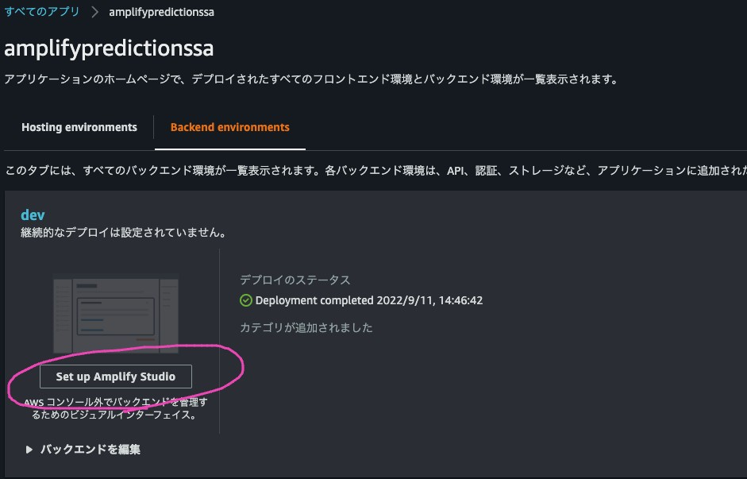

# Create Next.js App

https://docs.amplify.aws/start/getting-started/setup/q/integration/next/#create-a-new-nextjs-app

## Create

```
npx create-next-app amplify-predictions-sample
cd amplify-predictions-sample
```

## Run App

```
npm run dev
```

# Amplify init

https://docs.amplify.aws/start/getting-started/setup/q/integration/next/#initialize-a-new-backend

## init

```
amplify init
```

* console log

```
% amplify init
Note: It is recommended to run this command from the root of your app directory
? Enter a name for the project amplifypredictionssa
The following configuration will be applied:

Project information
| Name: amplifypredictionssa
| Environment: dev
| Default editor: Visual Studio Code
| App type: javascript
| Javascript framework: react
| Source Directory Path: src
| Distribution Directory Path: build
| Build Command: npm run-script build
| Start Command: npm run-script start

? Initialize the project with the above configuration? Yes
Using default provider  awscloudformation
? Select the authentication method you want to use: AWS profile

For more information on AWS Profiles, see:
https://docs.aws.amazon.com/cli/latest/userguide/cli-configure-profiles.html

? Please choose the profile you want to use arc
Adding backend environment dev to AWS Amplify app: dsu8q4ufgdb5o

Deployment completed.
Deployed root stack amplifypredictionssa [ ======================================== ] 4/4
        amplify-amplifypredictionssa-… AWS::CloudFormation::Stack     CREATE_COMPLETE                Sun Sep 11 2022 14:41:54…     
        UnauthRole                     AWS::IAM::Role                 CREATE_COMPLETE                Sun Sep 11 2022 14:41:50…     
        DeploymentBucket               AWS::S3::Bucket                CREATE_COMPLETE                Sun Sep 11 2022 14:41:48…     
        AuthRole                       AWS::IAM::Role                 CREATE_COMPLETE                Sun Sep 11 2022 14:41:50…     

✔ Help improve Amplify CLI by sharing non sensitive configurations on failures (y/N) · yes
Deployment bucket fetched.
✔ Initialized provider successfully.
✅ Initialized your environment successfully.

Your project has been successfully initialized and connected to the cloud!

Some next steps:
"amplify status" will show you what you've added already and if it's locally configured or deployed
"amplify add <category>" will allow you to add features like user login or a backend API
"amplify push" will build all your local backend resources and provision it in the cloud
"amplify console" to open the Amplify Console and view your project status
"amplify publish" will build all your local backend and frontend resources (if you have hosting category added) and provision it in the cloud

Pro tip:
Try "amplify add api" to create a backend API and then "amplify push" to deploy everything
```

## hosting

```
amplify add hosting
```

* console log

```
% amplify add hosting
✔ Select the plugin module to execute · Hosting with Amplify Console (Managed hosting with custom domains, Continuous deployment)
? Choose a type Manual deploymentmk

You can now publish your app using the following command:

Command: amplify publish
```

## Deploy

```
amplify push
```

* console log

```
% amplify push
✔ Successfully pulled backend environment dev from the cloud.

    Current Environment: dev
    
┌──────────┬────────────────┬───────────┬───────────────────┐
│ Category │ Resource name  │ Operation │ Provider plugin   │
├──────────┼────────────────┼───────────┼───────────────────┤
│ Hosting  │ amplifyhosting │ Create    │ awscloudformation │
└──────────┴────────────────┴───────────┴───────────────────┘
? Are you sure you want to continue? Yes

Deployment completed.
Deployed root stack amplifypredictionssa [ ======================================== ] 2/2
        amplify-amplifypredictionssa-… AWS::CloudFormation::Stack     UPDATE_COMPLETE                Sun Sep 11 2022 14:47:25…     
        hostingamplifyhosting          AWS::CloudFormation::Stack     CREATE_COMPLETE                Sun Sep 11 2022 14:47:22…     
Deployed hosting amplifyhosting [ ======================================== ] 1/1
        AmplifyBranch                  AWS::Amplify::Branch           CREATE_COMPLETE                Sun Sep 11 2022 14:47:09…     
```

## Use Amplify Studio 

* Set up Amplify Studio



