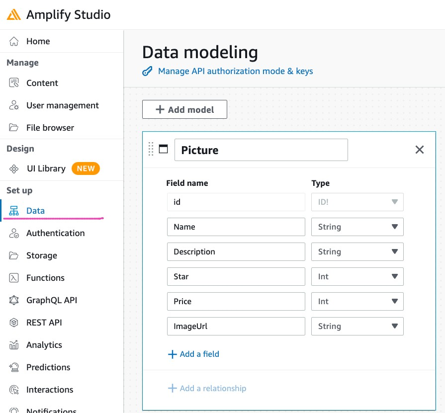
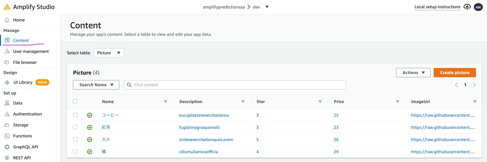
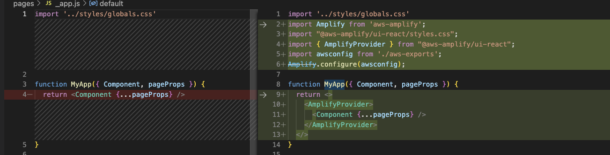
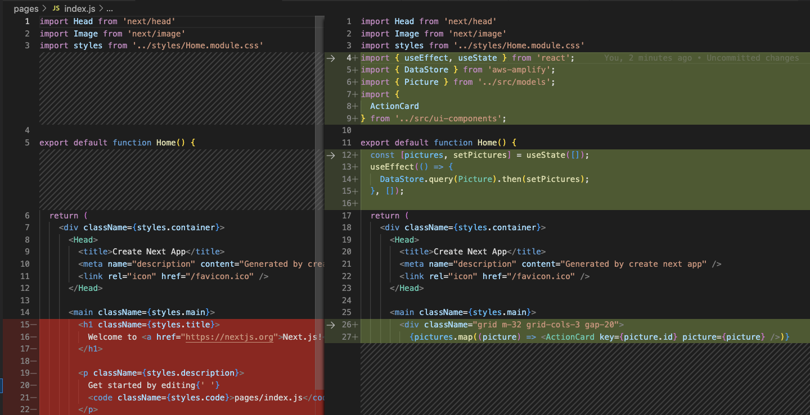

# Add Data

https://zenn.dev/thirosue/articles/70cc4696ca024c

## Define Data Model

* Create Picture Model



## Add Sample Data

| Name | Description | Star | Price |ImageUri |
|:-----------|:------------|------------:|------------:|:------------|
| コーヒー      | コクのある苦味がうりです   | 4  |500   |https://raw.githubusercontent.com/Thirosue/hosting-image/main/img/drink/coffee.jpeg         |
| 紅茶   | 風味豊かな紅茶です   | 3  |700   |https://raw.githubusercontent.com/Thirosue/hosting-image/main/img/drink/tea.jpeg         |
| カメ      | カメ   | 5  |500   |https://raw.githubusercontent.com/Thirosue/hosting-image/main/img/animal/testudines.jpeg         |
| 橋   | 大鳴門橋です   | 4  |700   |https://raw.githubusercontent.com/Thirosue/hosting-image/main/img/others/bridge.jpeg         |



# Sync Figma use UI Library

https://zenn.dev/thirosue/articles/70cc4696ca024c#%E3%82%B5%E3%83%B3%E3%83%97%E3%83%AB%E3%82%B3%E3%83%B3%E3%83%9D%E3%83%BC%E3%83%8D%E3%83%B3%E3%83%88%E5%8F%96%E3%82%8A%E8%BE%BC%E3%81%BF

## 

# Sync Compornents

```
amplfiy pull
```

# Get List Picture

https://docs.amplify.aws/lib/datastore/data-access/q/platform/js/#querying-for-all-items

## Install Amplify SDK

```
npm install aws-amplify @aws-amplify/ui-react
```

## Congigure Amplify

* before

> pages/_app.js

```javascript
import '../styles/globals.css'

function MyApp({ Component, pageProps }) {
  return <Component {...pageProps} />
}

export default MyApp
```

* after

```javascript
import '../styles/globals.css'
import Amplify from 'aws-amplify';
import "@aws-amplify/ui-react/styles.css";
import { AmplifyProvider } from "@aws-amplify/ui-react";
import awsconfig from '../src/aws-exports';
Amplify.configure(awsconfig);

function MyApp({ Component, pageProps }) {
  return <>
    <AmplifyProvider>
      <Component {...pageProps} />
    </AmplifyProvider>
  </>
}

export default MyApp
```

* diff 




## Install Tailwind

https://tailwindcss.com/docs/guides/nextjs

## Get Picture

https://docs.amplify.aws/lib/datastore/data-access/q/platform/js/#querying-for-all-items

> pages/index.js

```javascript
import { useEffect, useState } from 'react';
import { DataStore } from 'aws-amplify';
import { Picture } from '../src/models';
import {
  ActionCard
} from '../src/ui-components';

export default function Home() {
  const [pictures, setPictures] = useState([]);
  useEffect(() => {
    DataStore.query(Picture).then(setPictures);
  }, []);

  return (
    <div className={styles.container}>
      <Head>
        <title>Create Next App</title>
        <meta name="description" content="Generated by create next app" />
        <link rel="icon" href="/favicon.ico" />
      </Head>

      <main className={styles.main}>
        <div className="grid m-32 grid-cols-3 gap-20">
          {pictures.map((picture) => <ActionCard key={picture.id} picture={picture} />)}
        </div>
      </main>
```

* diff 



## Add Detail Page

```bash
mkdir pages/detail
```

> pages/detail/[id].js

```javascript
import { useState, useEffect } from 'react';
import { useRouter } from 'next/router'

export default function Home() {
    const router = useRouter()
    const { id } = router.query

    return (
        <>
            <div className="m-4 text-3xl font-bold">
                id: {id}
            </div>
        </>
    )
}
```
