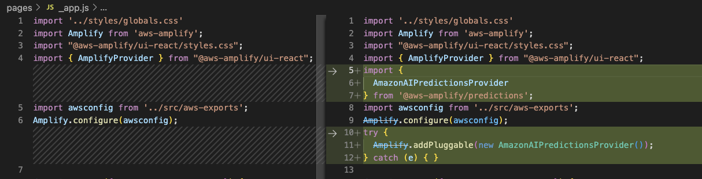
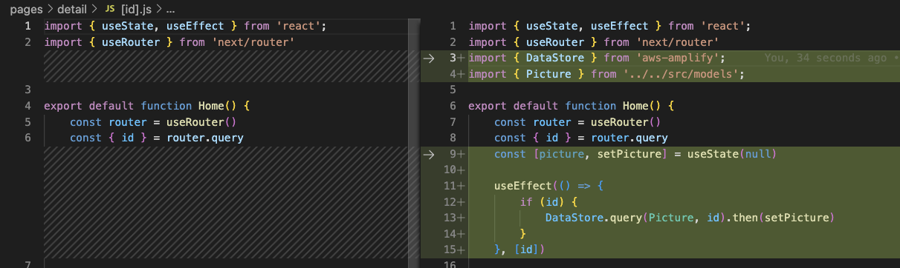
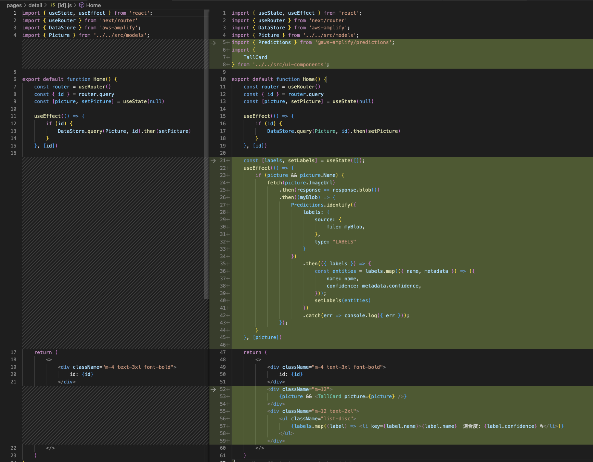
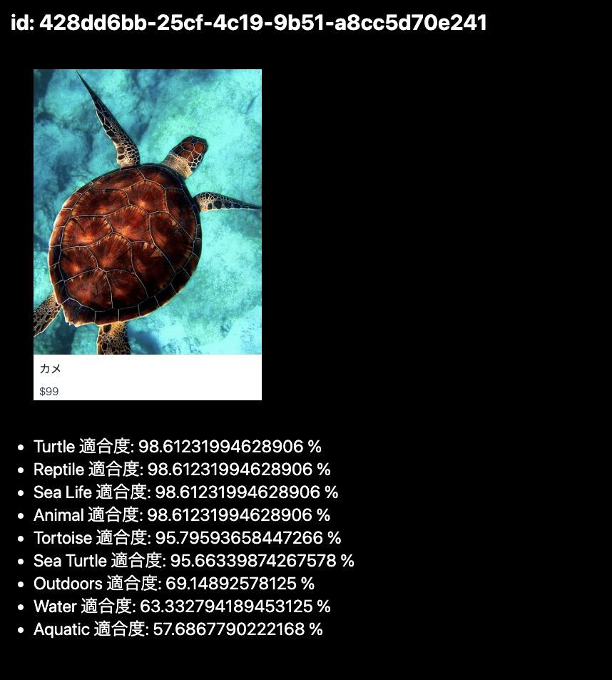

# Setup Predications

https://docs.amplify.aws/lib/predictions/label-image/q/platform/js/#setup-the-backend

## Setup

* add predictions with cognito

```
amplify add predictions
```

* console log

```bash
% amplify add predictions
? Please select from one of the categories below Identify
? You need to add auth (Amazon Cognito) to your project in order to add storage for user files. Do you want to add auth now? Yes
Using service: Cognito, provided by: awscloudformation
 
 The current configured provider is Amazon Cognito. 
 
 Do you want to use the default authentication and security configuration? Default configuration
 Warning: you will not be able to edit these selections. 
 How do you want users to be able to sign in? Username
 Do you want to configure advanced settings? No, I am done.
✅ Successfully added auth resource amplifypredictionssa1d63fb82 locally

✅ Some next steps:
"amplify push" will build all your local backend resources and provision it in the cloud
"amplify publish" will build all your local backend and frontend resources (if you have hosting category added) and provision it in the cloud

? What would you like to identify? Identify Labels
? Provide a friendly name for your resource identifyLabels2040e020
? Would you like use the default configuration? Default Configuration
? Who should have access? Auth and Guest users
Auth configuration is required to allow unauthenticated users, but it is not configured properly.
✅ Successfully updated auth resource locally.
Successfully added resource identifyLabels2040e020 locally

Some next steps:
"amplify push" builds all of your local backend resources and provisions them in the cloud
"amplify publish" builds all of your local backend and front-end resources (if you added hosting category) and provisions them in the cloud
```

## Deploy

```
amplify push
```

* console log

```bash
% amplify push
⠙ Fetching updates to backend environment: dev from the cloud.✅ GraphQL schema compiled successfully.

Edit your schema at /Users/takeshi.hirosue/private/workspace/amplify-predictions-sample/amplify/backend/api/amplifypredictionssa/schema.graphql or place .graphql files in a directory at /Users/takeshi.hirosue/private/workspace/amplify-predictions-sample/amplify/backend/api/amplifypredictionssa/schema
✔ Successfully pulled backend environment dev from the cloud.

    Current Environment: dev
    
┌─────────────┬──────────────────────────────┬───────────┬───────────────────┐
│ Category    │ Resource name                │ Operation │ Provider plugin   │
├─────────────┼──────────────────────────────┼───────────┼───────────────────┤
│ Auth        │ amplifypredictionssa1d63fb82 │ Create    │ awscloudformation │
├─────────────┼──────────────────────────────┼───────────┼───────────────────┤
│ Predictions │ identifyLabels2040e020       │ Create    │ awscloudformation │
├─────────────┼──────────────────────────────┼───────────┼───────────────────┤
│ Hosting     │ amplifyhosting               │ No Change │ awscloudformation │
├─────────────┼──────────────────────────────┼───────────┼───────────────────┤
│ Api         │ amplifypredictionssa         │ No Change │ awscloudformation │
└─────────────┴──────────────────────────────┴───────────┴───────────────────┘
? Are you sure you want to continue? Yes

Deployment completed.
Deployed root stack amplifypredictionssa [ ======================================== ] 5/5
        amplify-amplifypredictionssa-… AWS::CloudFormation::Stack     UPDATE_COMPLETE                Sun Sep 11 2022 15:52:45…     
        hostingamplifyhosting          AWS::CloudFormation::Stack     UPDATE_COMPLETE                Sun Sep 11 2022 15:49:32…     
        apiamplifypredictionssa        AWS::CloudFormation::Stack     UPDATE_COMPLETE                Sun Sep 11 2022 15:49:54…     
        predictionsidentifyLabels2040… AWS::CloudFormation::Stack     CREATE_COMPLETE                Sun Sep 11 2022 15:50:20…     
        authamplifypredictionssa1d63f… AWS::CloudFormation::Stack     CREATE_COMPLETE                Sun Sep 11 2022 15:52:11…     
Deployed auth amplifypredictionssa1d63fb82 [ ======================================== ] 10/10
        UserPool                       AWS::Cognito::UserPool         CREATE_COMPLETE                Sun Sep 11 2022 15:49:41…     
        UserPoolClient                 AWS::Cognito::UserPoolClient   CREATE_COMPLETE                Sun Sep 11 2022 15:49:46…     
        UserPoolClientWeb              AWS::Cognito::UserPoolClient   CREATE_COMPLETE                Sun Sep 11 2022 15:49:46…     
        UserPoolClientRole             AWS::IAM::Role                 CREATE_COMPLETE                Sun Sep 11 2022 15:50:17…     
        UserPoolClientLambda           AWS::Lambda::Function          CREATE_COMPLETE                Sun Sep 11 2022 15:50:30…     
        UserPoolClientLambdaPolicy     AWS::IAM::Policy               CREATE_COMPLETE                Sun Sep 11 2022 15:51:01…     
        UserPoolClientLogPolicy        AWS::IAM::Policy               CREATE_COMPLETE                Sun Sep 11 2022 15:51:31…     
        UserPoolClientInputs           Custom::LambdaCallout          CREATE_COMPLETE                Sun Sep 11 2022 15:51:40…     
        IdentityPool                   AWS::Cognito::IdentityPool     CREATE_COMPLETE                Sun Sep 11 2022 15:51:45…     
        IdentityPoolRoleMap            AWS::Cognito::IdentityPoolRol… CREATE_COMPLETE                Sun Sep 11 2022 15:51:50…     
Deployed predictions identifyLabels2040e020 [ ======================================== ] 1/1
        identifyLabelssPolicy          AWS::IAM::Policy               CREATE_COMPLETE                Sun Sep 11 2022 15:50:06…     


GraphQL transformer version: 2
```

## Congigure

https://docs.amplify.aws/lib/predictions/getting-started/q/platform/js/

> pages/_app.js

* before

```javascript
import '../styles/globals.css'
import Amplify from 'aws-amplify';
import "@aws-amplify/ui-react/styles.css";
import { AmplifyProvider } from "@aws-amplify/ui-react";
import awsconfig from '../src/aws-exports';
Amplify.configure(awsconfig);
```

* after 

```javascript
import '../styles/globals.css'
import Amplify from 'aws-amplify';
import "@aws-amplify/ui-react/styles.css";
import { AmplifyProvider } from "@aws-amplify/ui-react";
import {
  AmazonAIPredictionsProvider
} from '@aws-amplify/predictions';
import awsconfig from '../src/aws-exports';
Amplify.configure(awsconfig);
try {
  Amplify.addPluggable(new AmazonAIPredictionsProvider());
} catch (e) { }
```

* diff 



## Get Picture By Id 

* before

```javascript
import { useRouter } from 'next/router'

export default function Home() {
    const router = useRouter()
    const { id } = router.query
```

* after

```javascript
import { useRouter } from 'next/router'
import { DataStore } from 'aws-amplify';
import { Picture } from '../../src/models';

export default function Home() {
    const router = useRouter()
    const { id } = router.query
    const [picture, setPicture] = useState(null)

    useEffect(() => {
        if (id) {
            DataStore.query(Picture, id).then(setPicture)
        }
    }, [id])
```

* diff



## Add Picture Labels

https://docs.amplify.aws/lib/predictions/label-image/q/platform/js/

* add import

```javascript
import { Predictions } from '@aws-amplify/predictions';
import {
    TallCard
} from '../../src/ui-components';
```

* add hooks

```javascript
    const [labels, setLabels] = useState([]);
    useEffect(() => {
        if (picture && picture.Name) {
            fetch(picture.ImageUrl)
                .then(response => response.blob())
                .then((myBlob) => {
                    Predictions.identify({
                        labels: {
                            source: {
                                file: myBlob,
                            },
                            type: "LABELS"
                        }
                    })
                        .then(({ labels }) => {
                            const entities = labels.map(({ name, metadata }) => ({
                                name: name,
                                confidence: metadata.confidence,
                            }));
                            setLabels(entities)
                        })
                        .catch(err => console.log({ err }));
                });
        }
    }, [picture])
```

* add template

```
            <div className="m-12">
                {picture && <TallCard picture={picture} />}
            </div>
            <div className="m-12 text-2xl">
                <ul className="list-disc">
                    {labels.map((label) => <li key={label.name}>{label.name}  適合度: {label.confidence} %</li>)}
                </ul>
            </div>
```

* diff



## Detail Page

